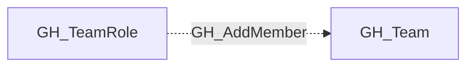

# GH_AddMember

## General Information

The non-traversable GH_AddMember edge indicates that a team role with the Maintainer permission level can add new members to the team. Maintainers already inherit the team's repository permissions through GH_MemberOf, so this edge preserves the membership-management capability as context without creating a second access path to the same team.

## Edge Schema

| Source | Destination | Traversable |
| --- | --- | --- |
| `GH_TeamRole` | `GH_Team` | `false` |

## Diagram

