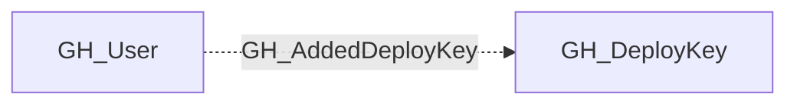

# GH_AddedDeployKey

## General Information

User added this repository deploy key.

## Edge Schema

| Source | Destination | Traversable |
| --- | --- | --- |
| `GH_User` | `GH_DeployKey` | `false` |

## Diagram

