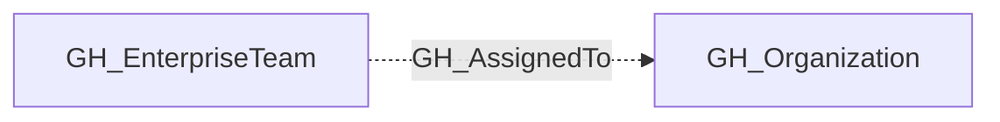

# GH_AssignedTo

## General Information

The non-traversable GH_AssignedTo edge represents an enterprise-scoped team being assigned to an organization.

This edge is not traversable because assignment alone does not directly grant a principal a privilege path.

## Edge Schema

| Source | Destination | Traversable |
| --- | --- | --- |
| `GH_EnterpriseTeam` | `GH_Organization` | `false` |

## Diagram

