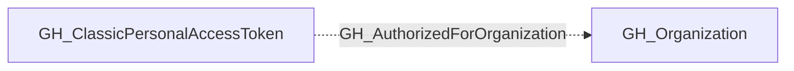

# GH_AuthorizedForOrganization

## General Information

Classic personal access token has a recorded authorization for this organization.

## Edge Schema

| Source | Destination | Traversable |
| --- | --- | --- |
| `GH_ClassicPersonalAccessToken` | `GH_Organization` | `false` |

## Diagram

