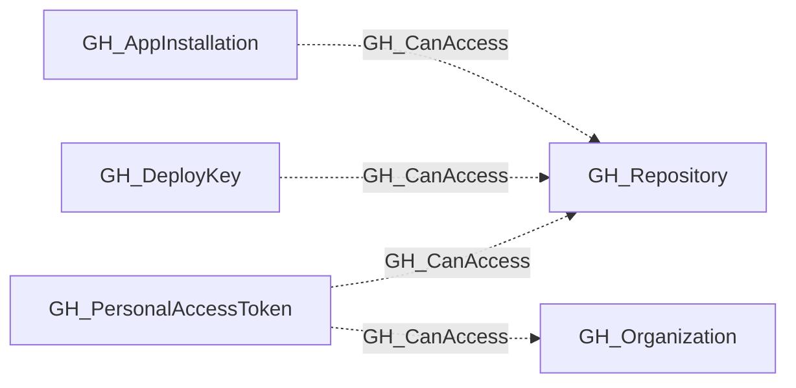

# GH_CanAccess

## General Information

The non-traversable GH_CanAccess edge indicates that a personal access token, app installation, or deploy key has been granted access to a repository or organization. This edge represents the scope of access granted to a non-human credential rather than a direct attack path, providing visibility into which repositories are reachable through that credential. It is non-traversable because credential access does not transitively extend to other principals.

## Edge Schema

| Source | Destination | Traversable |
| --- | --- | --- |
| `GH_AppInstallation` | `GH_Repository` | `false` |
| `GH_DeployKey` | `GH_Repository` | `false` |
| `GH_PersonalAccessToken` | `GH_Organization` | `false` |
| `GH_PersonalAccessToken` | `GH_Repository` | `false` |

## Diagram

