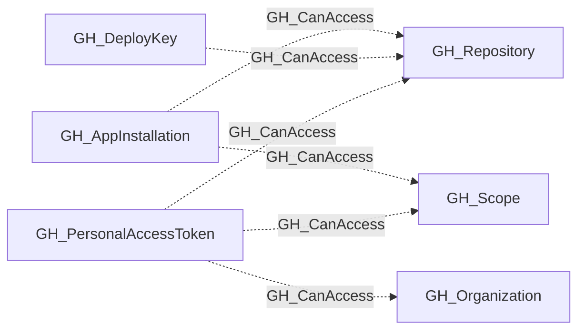

# GH_CanAccess

## General Information

The non-traversable GH_CanAccess edge indicates that a personal access token, app installation, or deploy key has been granted access to a repository, reusable scope, or organization. All-repository app installations and PATs point to an organization-scoped GH_Scope with `scope_type=repository` instead of repeating an edge to every repository. This edge represents access scope rather than a direct attack path.

## Edge Schema

| Source | Destination | Traversable |
| --- | --- | --- |
| `GH_AppInstallation` | `GH_Repository` | `false` |
| `GH_AppInstallation` | `GH_Scope` | `false` |
| `GH_DeployKey` | `GH_Repository` | `false` |
| `GH_PersonalAccessToken` | `GH_Organization` | `false` |
| `GH_PersonalAccessToken` | `GH_Repository` | `false` |
| `GH_PersonalAccessToken` | `GH_Scope` | `false` |

## Diagram

```mermaid
graph LR
    n0["GH_AppInstallation"]
    n1["GH_Repository"]
    n2["GH_Scope"]
    n3["GH_DeployKey"]
    n4["GH_PersonalAccessToken"]
    n5["GH_Organization"]
    n0 -.->|GH_CanAccess| n1
    n0 -.->|GH_CanAccess| n2
    n3 -.->|GH_CanAccess| n1
    n4 -.->|GH_CanAccess| n5
    n4 -.->|GH_CanAccess| n1
    n4 -.->|GH_CanAccess| n2
```
