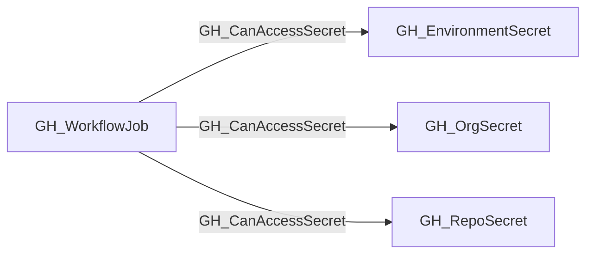

# GH_CanAccessSecret

## General Information

The traversable GH_CanAccessSecret edge represents that a GitHub Actions workflow job execution context can access a statically referenced secret.

This edge is derived from the existing non-traversable GH_UsesSecret relationships on the job's contained steps and from job-level `env` declarations. It is intended for attack-path analysis from a compromised job execution context to the secrets that context can read.

The collector only emits this edge when one of the workflow job's modeled steps or the job's `env` block statically references the secret. The existence of a secret in the repository, organization, or environment scope alone is not enough. For this initial implementation, secrets passed through `jobs.<job_id>.secrets` to reusable workflows are retained as structural references but are not projected as runtime access for the caller job.

## Edge Schema

| Source | Destination | Traversable |
| --- | --- | --- |
| `GH_WorkflowJob` | `GH_EnvironmentSecret` | `true` |
| `GH_WorkflowJob` | `GH_OrgSecret` | `true` |
| `GH_WorkflowJob` | `GH_RepoSecret` | `true` |

## Diagram

