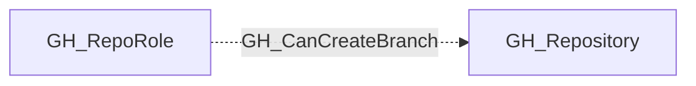

# GH_CanCreateBranch

## General Information

The traversable GH_CanCreateBranch edge is a computed edge indicating that a role or actor can create new branches in a repository. The computation evaluates whether a wildcard (`*`) BPR with push restrictions and `blocks_creations` exists. If no such BPR exists, any write-capable role can create branches. If one exists, admin or `push_protected_branch` permission is required, or the actor must be listed in pushAllowances. Per-actor edges from GH_User or GH_Team are only emitted when BPR allowances grant branch creation access beyond what the role provides. Each edge includes a `reason` property and a `query_composition` Cypher query showing the underlying graph evidence.

## Scenarios

### `no_protection` — No wildcard BPR blocking creations

No wildcard (`*`) BPR with `blocks_creations` exists. Any write-capable role can create new branches.

## Edge Schema

| Source | Destination | Traversable |
| --- | --- | --- |
| `GH_RepoRole` | `GH_Repository` | `false` |

## Diagram

