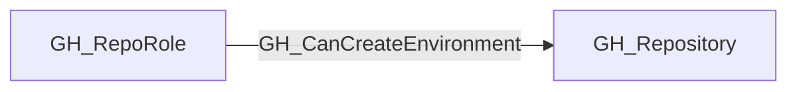

# GH_CanCreateEnvironment

## General Information

The traversable GH_CanCreateEnvironment edge is a computed edge indicating that a repository role can cause a new GitHub environment to be created in the repository. This is derived from the ability to create and modify runnable branches/workflows: if a workflow references an environment name that does not already exist, GitHub will create that environment automatically.

This edge is useful for modeling OIDC and deployment scenarios where trust is tied to an environment name. An attacker who can create a new environment through workflow changes may be able to instantiate a trusted environment on demand, even if it was not previously configured.

## Edge Schema

| Source | Destination | Traversable |
| --- | --- | --- |
| `GH_RepoRole` | `GH_Repository` | `true` |

## Diagram

