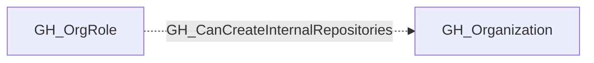

# GH_CanCreateInternalRepositories

## General Information

Role can create internal repositories in the organization.

## Edge Schema

| Source | Destination | Traversable |
| --- | --- | --- |
| `GH_OrgRole` | `GH_Organization` | `false` |

## Diagram

