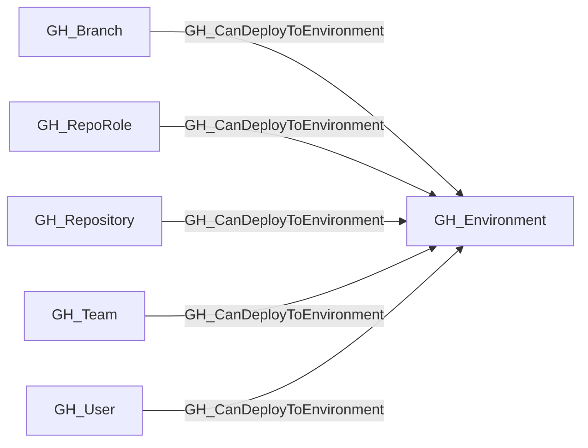

# GH_CanDeployToEnvironment

## General Information

The traversable GH_CanDeployToEnvironment edge represents the ability for a repository, branch, repository role, or reviewer to satisfy the modeled deployment constraints for a GitHub Environment.

This edge is computed from environment deployment branch policy, branch protection state, required reviewer behavior, and administrator bypass behavior. For environments without required reviewers, unrestricted environments emit repository and branch edges, protected-branch-only environments emit edges only for protected branches unless no branch protection rules exist, and custom branch policies emit edges only for matching branches.

When required reviewers are configured and self-review is allowed, a configured GH_User or GH_Team reviewer receives GH_CanDeployToEnvironment only when the same actor can also supply deployable code. For unrestricted environments this means the actor can create a branch in the repository. For protected-branch-only or custom branch policy environments this means the actor can write to an eligible branch under the existing GH_CanWriteBranch rules.

Self-review alone is not sufficient for this edge. GH_ApprovesDeploymentTo remains the non-traversable representation of reviewer authority, while GH_CanDeployToEnvironment represents the combined ability to satisfy both the approval gate and the code-supply path. When prevent_self_review is enabled, no direct deploy edge is emitted for the reviewer because the required split-principal flow is not currently modeled.

## Edge Schema

| Source | Destination | Traversable |
| --- | --- | --- |
| `GH_Branch` | `GH_Environment` | `true` |
| `GH_RepoRole` | `GH_Environment` | `true` |
| `GH_Repository` | `GH_Environment` | `true` |
| `GH_Team` | `GH_Environment` | `true` |
| `GH_User` | `GH_Environment` | `true` |

## Diagram

