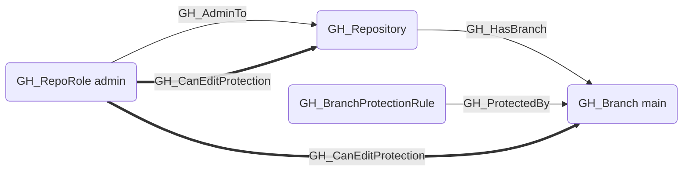
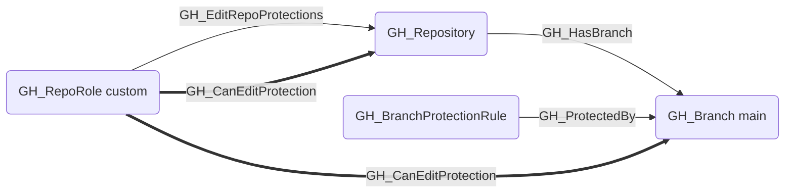

## General Information

The traversable GH_CanEditProtection edge is a computed edge indicating that a role can modify or remove branch protection rules in a repository. This edge is emitted when the role has GH_EditRepoProtections or GH_AdminTo permissions and the repository contains at least one protected branch. Repo-targeted edges model the repo-wide security impact for attack path traversal; branch-targeted edges are also emitted as supporting evidence for each protected branch governed by those rules.

## Scenarios

### `admin` — Admin can edit protections

The admin role has GH_AdminTo which implicitly grants the ability to modify or remove any branch protection rule.

### `edit_repo_protections` — Explicit edit permission

A custom or standard role with the GH_EditRepoProtections permission can modify or remove branch protection rules.

