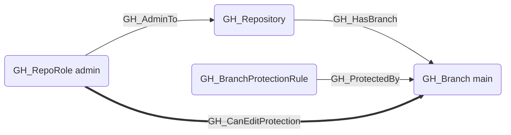
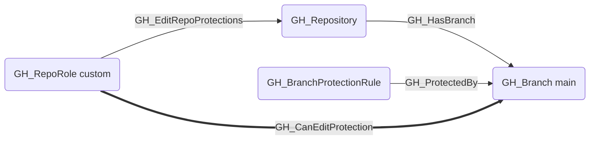

## General Information

The traversable GH_CanEditProtection edge is a computed edge indicating that a role can modify or remove the branch protection rules governing a specific branch. This edge is emitted when the role has GH_EditRepoProtections or GH_AdminTo permissions and the branch is covered by at least one branch protection rule. The edge targets the protected branch (not the BPR itself) because the security impact is evaluated per-branch — a role that can weaken or remove protections on a branch can subsequently push code to it, representing a privilege escalation path.

## Scenarios

### `admin` — Admin can edit protections

The admin role has GH_AdminTo which implicitly grants the ability to modify or remove any branch protection rule.

### `edit_repo_protections` — Explicit edit permission

A custom or standard role with the GH_EditRepoProtections permission can modify or remove branch protection rules.

