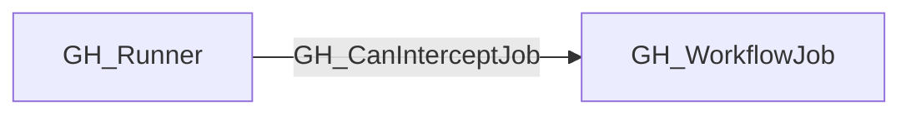

# GH_CanInterceptJob

## General Information

The traversable GH_CanInterceptJob edge represents that a self-hosted runner not explicitly marked ephemeral can intercept a GitHub Actions workflow job that GitHub could schedule on it.

This edge is derived from GH_RunsOn and is intended for attack-path analysis. It does not mean that the job has historically executed on the runner. It means that control of the runner may expose the future execution context of the job when the runner is not ephemeral.

The collector does not emit this edge for runners GitHub explicitly marks as ephemeral.

## Edge Schema

| Source | Destination | Traversable |
| --- | --- | --- |
| `GH_Runner` | `GH_WorkflowJob` | `true` |

## Diagram

