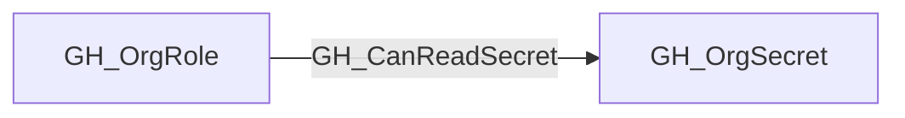

# GH_CanReadSecret

## General Information

Org role can read an organization secret by creating a repository in scope.

## Edge Schema

| Source | Destination | Traversable |
| --- | --- | --- |
| `GH_OrgRole` | `GH_OrgSecret` | `true` |

## Diagram

