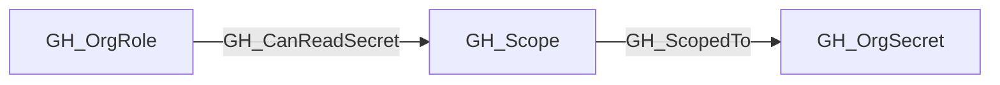

# GH_CanReadSecret

## General Information

Org role can read organization secrets by creating a repository in the matching organization-secret scope. The collector emits this relationship from the role to a reusable `GH_Scope`; `GH_ScopedTo` expands the scope to its `all` or `private_or_internal` organization secrets. Selected secrets do not receive this derived capability because creating a repository does not add that repository to an arbitrary selected set.

## Edge Schema

| Source | Destination | Traversable |
| --- | --- | --- |
| `GH_OrgRole` | `GH_OrgSecret` | `true` |
| `GH_OrgRole` | `GH_Scope` | `true` |

`GH_OrgRole` to `GH_OrgSecret` remains an accepted legacy schema endpoint. Current OpenHound collections emit `GH_OrgRole` to `GH_Scope` instead.

## Diagram

```mermaid
graph LR
    n0["GH_OrgRole"]
    n1["GH_Scope"]
    n2["GH_OrgSecret"]
    n0 -->|GH_CanReadSecret| n1
    n1 -->|GH_ScopedTo| n2
```
