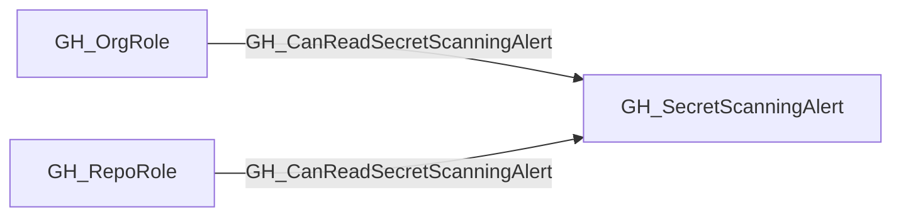

# GH_CanReadSecretScanningAlert

## General Information

The traversable GH_CanReadSecretScanningAlert edge is a computed edge indicating that a role can read a specific secret scanning alert, including the leaked secret value. The computation cross-references GH_ViewSecretScanningAlerts permission edges with GH_Contains structural edges (org-level and repo-level) to determine which alerts each role can access. This edge is traversable because reading an alert reveals the leaked secret — if the secret is a valid GitHub Personal Access Token, the GH_ValidToken edge enables identity compromise of the token's owner.

Each edge includes a `reason` property (`org_role_permission` or `repo_role_permission`) and a `query_composition` Cypher query showing the underlying graph evidence.

## Scenarios

### `org_role_permission` — Org role views alerts via organization

An org role with GH_ViewSecretScanningAlerts to the organization can read all secret scanning alerts across the entire org. The computation follows GH_Contains edges from the organization to each alert.

## Edge Schema

| Source | Destination | Traversable |
| --- | --- | --- |
| `GH_OrgRole` | `GH_SecretScanningAlert` | `true` |
| `GH_RepoRole` | `GH_SecretScanningAlert` | `true` |

## Diagram

