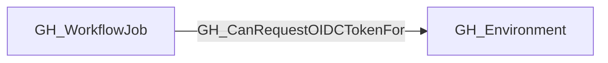

# GH_CanRequestOIDCTokenFor

## General Information

The traversable GH_CanRequestOIDCTokenFor edge represents that a GitHub Actions workflow job execution context can request a GitHub-signed OIDC token containing claims for its associated GitHub Environment.

This edge is derived from the existing GH_DeploysTo relationship and the job's calculated `effective_github_token_permissions`. The collector emits it only when the job targets a statically resolved environment and its effective permissions include `id-token:write`.

This is a capability edge, not evidence that the workflow has historically requested a token or contains an explicit OIDC-related step. Code executing in a job with `id-token:write` can request the token directly.

## Edge Schema

| Source | Destination | Traversable |
| --- | --- | --- |
| `GH_WorkflowJob` | `GH_Environment` | `true` |

## Diagram

