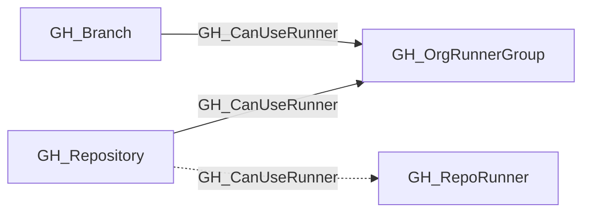

# GH_CanUseRunner

## General Information

For runner-group-backed access, the traversable GH_CanUseRunner edge is a computed edge representing that a repository or branch can dispatch workflows to a self-hosted runner execution surface under the modeled runner-group controls.

The collector derives this edge from GH_IsEligibleFor rather than directly from repository visibility. It emits GH_CanUseRunner only when the repository is within the runner group's repository-access scope, GitHub Actions is enabled for the repository, and `restricted_to_workflows=false` on the organization-facing runner group. Inherited enterprise-backed access also requires `restricted_to_workflows=false` on the source GH_EnterpriseRunnerGroup. Every collected branch in a repository that satisfies those conditions receives the same edge so branch write paths can reach the execution surface.

Organization and inherited enterprise-backed access terminate at the organization-facing GH_OrgRunnerGroup, then continue through GH_HasRunner for native organization runners or through GH_InheritedFrom and GH_HasRunner for inherited enterprise runners. Repository-scoped runners currently receive GH_CanUseRunner directly from their containing repository and are not part of this runner-group traversability change.

## Edge Schema

| Source | Destination | Traversable |
| --- | --- | --- |
| `GH_Branch` | `GH_OrgRunnerGroup` | `true` |
| `GH_Repository` | `GH_OrgRunnerGroup` | `true` |
| `GH_Repository` | `GH_RepoRunner` | `false` |

## Diagram

