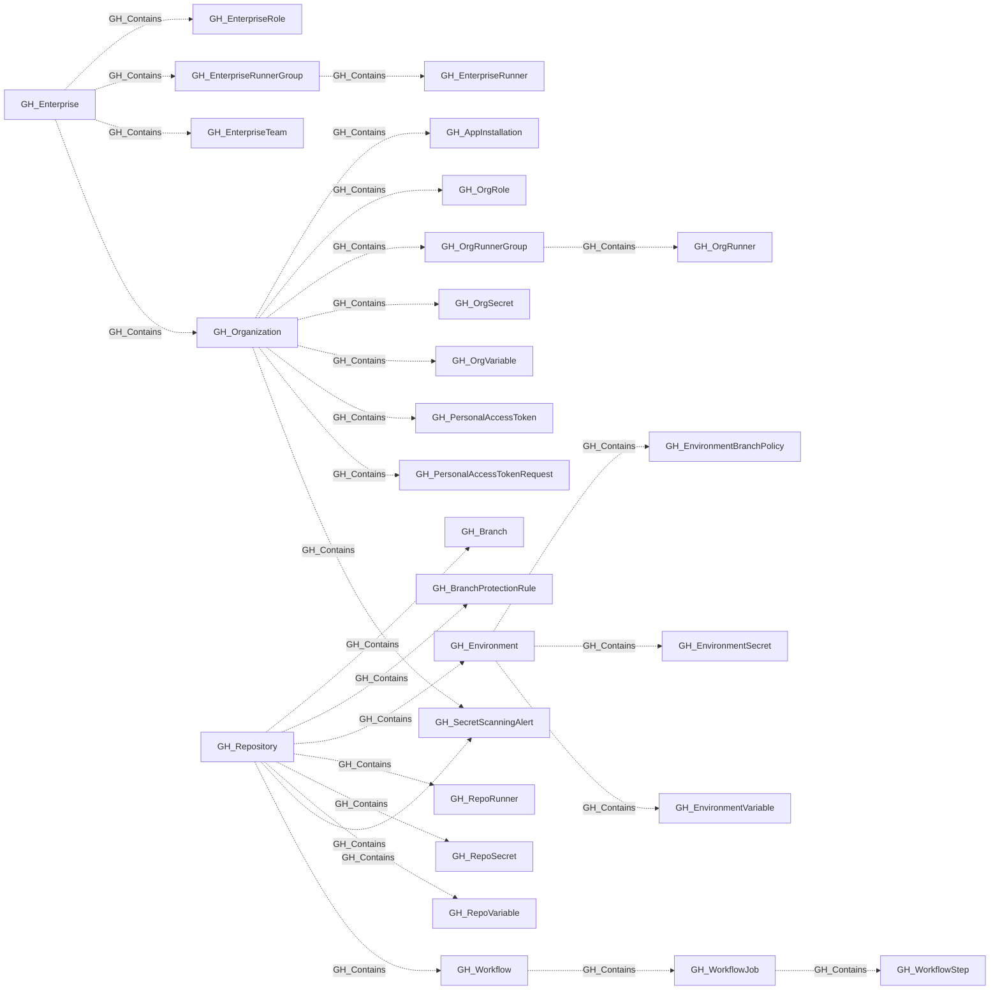

# GH_Contains

## General Information

The non-traversable GH_Contains edge represents structural containment within the GitHub resource hierarchy. The enterprise contains enterprise teams, roles, managed users, runner groups, and enterprise runners through their groups. The organization serves as a top-level container for users, teams, repositories, roles, secrets, app installations, personal access tokens, and organization runner groups. Native organization runner groups contain organization runners. Repositories contain branches, workflows, branch protection rules, environments, repo-level secrets and variables, and repository-scoped runners. Environments contain environment branch policies, environment-scoped secrets, and environment-scoped variables. This edge is created by the collector to establish the resource hierarchy and is not traversable because containment alone does not imply privilege escalation.

## Edge Schema

| Source | Destination | Traversable |
| --- | --- | --- |
| `GH_Enterprise` | `GH_EnterpriseRole` | `false` |
| `GH_Enterprise` | `GH_EnterpriseRunnerGroup` | `false` |
| `GH_Enterprise` | `GH_EnterpriseTeam` | `false` |
| `GH_Enterprise` | `GH_Organization` | `false` |
| `GH_EnterpriseRunnerGroup` | `GH_EnterpriseRunner` | `false` |
| `GH_Environment` | `GH_EnvironmentBranchPolicy` | `false` |
| `GH_Environment` | `GH_EnvironmentSecret` | `false` |
| `GH_Environment` | `GH_EnvironmentVariable` | `false` |
| `GH_OrgRunnerGroup` | `GH_OrgRunner` | `false` |
| `GH_Organization` | `GH_AppInstallation` | `false` |
| `GH_Organization` | `GH_OrgRole` | `false` |
| `GH_Organization` | `GH_OrgRunnerGroup` | `false` |
| `GH_Organization` | `GH_OrgSecret` | `false` |
| `GH_Organization` | `GH_OrgVariable` | `false` |
| `GH_Organization` | `GH_PersonalAccessToken` | `false` |
| `GH_Organization` | `GH_PersonalAccessTokenRequest` | `false` |
| `GH_Organization` | `GH_SecretScanningAlert` | `false` |
| `GH_Repository` | `GH_Branch` | `false` |
| `GH_Repository` | `GH_BranchProtectionRule` | `false` |
| `GH_Repository` | `GH_Environment` | `false` |
| `GH_Repository` | `GH_RepoRunner` | `false` |
| `GH_Repository` | `GH_RepoSecret` | `false` |
| `GH_Repository` | `GH_RepoVariable` | `false` |
| `GH_Repository` | `GH_SecretScanningAlert` | `false` |
| `GH_Repository` | `GH_Workflow` | `false` |
| `GH_Workflow` | `GH_WorkflowJob` | `false` |
| `GH_WorkflowJob` | `GH_WorkflowStep` | `false` |

## Diagram

