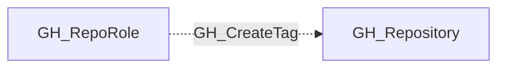

# GH_CreateTag

## General Information

The non-traversable GH_CreateTag edge represents a role's ability to create tags and releases. This permission is available to Maintain and Admin roles and custom roles that have been granted this specific permission. Creating tags can trigger CI/CD workflows and publish release artifacts.

## Edge Schema

| Source | Destination | Traversable |
| --- | --- | --- |
| `GH_RepoRole` | `GH_Repository` | `false` |

## Diagram

