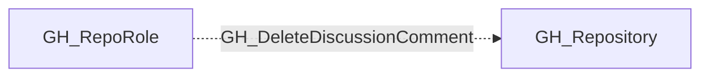

# GH_DeleteDiscussionComment

## General Information

The non-traversable GH_DeleteDiscussionComment edge represents a role's ability to delete discussion comments authored by any user. This permission is available to Triage, Write, Maintain, and Admin roles and custom roles that have been granted this specific permission.

## Edge Schema

| Source | Destination | Traversable |
| --- | --- | --- |
| `GH_RepoRole` | `GH_Repository` | `false` |

## Diagram

