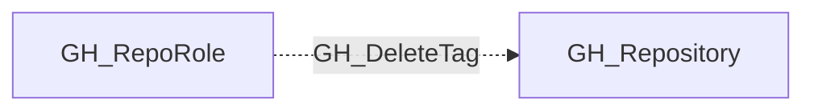

# GH_DeleteTag

## General Information

The non-traversable GH_DeleteTag edge represents a role's ability to delete tags and releases. This permission is available to Admin roles and custom roles that have been granted this specific permission. Deleting tags can break downstream dependency references and remove published artifacts.

## Edge Schema

| Source | Destination | Traversable |
| --- | --- | --- |
| `GH_RepoRole` | `GH_Repository` | `false` |

## Diagram

