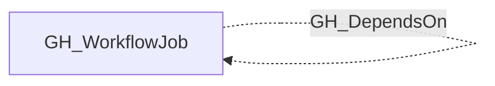

# GH_DependsOn

## General Information

The non-traversable GH_DependsOn edge represents a `needs:` dependency between two jobs in the same workflow. This edge captures execution order constraints — the source job will not start until the destination job completes successfully. This edge is non-traversable because it represents sequencing only, not an access or privilege path.

## Edge Schema

| Source | Destination | Traversable |
| --- | --- | --- |
| `GH_WorkflowJob` | `GH_WorkflowJob` | `false` |

## Diagram

