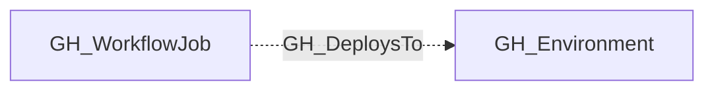

# GH_DeploysTo

## General Information

The non-traversable GH_DeploysTo edge links a workflow job to the GitHub Environment it targets via the `environment:` key. This edge records which jobs deploy to which environments. Environments can gate deployments with protection rules (required reviewers, wait timers, deployment branch policies) and can expose environment-scoped secrets and variables.

## Edge Schema

| Source | Destination | Traversable |
| --- | --- | --- |
| `GH_WorkflowJob` | `GH_Environment` | `false` |

## Diagram

