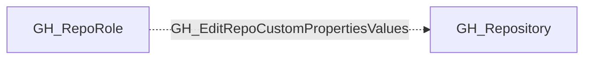

# GH_EditRepoCustomPropertiesValues

## General Information

The non-traversable GH_EditRepoCustomPropertiesValues edge represents a role's ability to edit custom property values on the repository. This permission is available to Admin roles and custom roles that have been granted this specific permission. Custom properties are organization-defined metadata fields on repositories that can be used for classification, compliance tagging, or policy enforcement via rulesets. Modifying custom property values could alter which organization-level rulesets apply to the repository, potentially bypassing security controls that are scoped by property-based targeting.

## Edge Schema

| Source | Destination | Traversable |
| --- | --- | --- |
| `GH_RepoRole` | `GH_Repository` | `false` |

## Diagram

