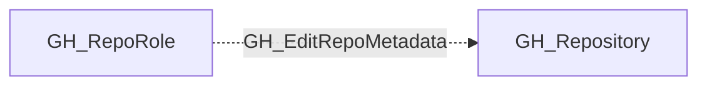

# GH_EditRepoMetadata

## General Information

The non-traversable GH_EditRepoMetadata edge represents a role's ability to edit repository metadata including description, homepage URL, and visibility settings. This permission is available to Maintain and Admin roles and custom roles that have been granted this specific permission.

## Edge Schema

| Source | Destination | Traversable |
| --- | --- | --- |
| `GH_RepoRole` | `GH_Repository` | `false` |

## Diagram

