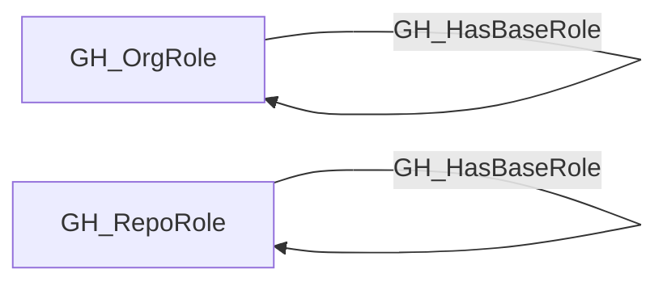

# GH_HasBaseRole

## General Information

The traversable GH_HasBaseRole edge represents role inheritance within the GitHub permission hierarchy. Org roles inherit down to all-repo roles (e.g., Owners inherits to all_repo_admin), and custom roles inherit from their base roles (e.g., a custom_role inherits from write). This edge is traversable because it extends permissions through the role hierarchy, meaning a principal with a higher-level role implicitly holds all inherited lower-level roles.

## Edge Schema

| Source | Destination | Traversable |
| --- | --- | --- |
| `GH_OrgRole` | `GH_OrgRole` | `true` |
| `GH_RepoRole` | `GH_RepoRole` | `true` |

## Diagram

