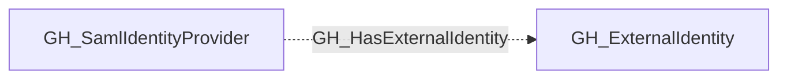

# GH_HasExternalIdentity

## General Information

The non-traversable GH_HasExternalIdentity edge represents the relationship between a SAML identity provider and the external identities (SSO users) it manages. This edge links each external identity to the SAML provider that authenticated it. External identities are a key component in cross-platform attack path analysis because they bridge the gap between corporate identity providers and GitHub user accounts via the GH_MapsToUser edge. Enumerating external identities reveals which corporate users have linked GitHub accounts and enables mapping from IdP compromise to GitHub access.

## Edge Schema

| Source | Destination | Traversable |
| --- | --- | --- |
| `GH_SamlIdentityProvider` | `GH_ExternalIdentity` | `false` |

## Diagram

