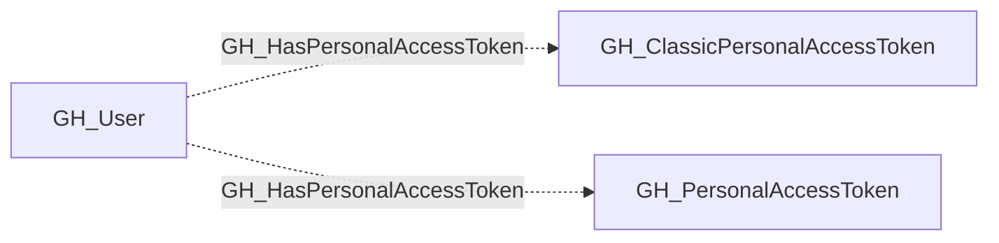

# GH_HasPersonalAccessToken

## General Information

The non-traversable GH_HasPersonalAccessToken edge links a user to a personal access token they own. Fine-grained token ownership comes from organization approvals; classic token ownership comes from the enterprise credential inventory. The edge identifies the owner but does not by itself grant access to any organization or repository.

## Edge Schema

| Source | Destination | Traversable |
| --- | --- | --- |
| `GH_User` | `GH_ClassicPersonalAccessToken` | `false` |
| `GH_User` | `GH_PersonalAccessToken` | `false` |

## Diagram

