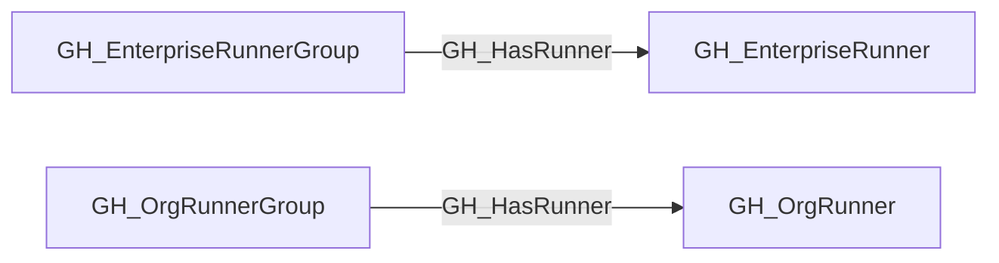

# GH_HasRunner

## General Information

The traversable GH_HasRunner edge represents that a runner group exposes a directly assigned self-hosted runner to repositories or workflows that satisfy the runner group's access policy.

This edge is distinct from GH_Contains. GH_Contains records structural membership only, while GH_HasRunner represents the runner-group-to-runner capability hop used for attack-path composition. This edge is emitted only for direct organization and enterprise runner group memberships; inherited organization runner group access to enterprise runners is modeled as GH_Repository or GH_Branch -[:GH_CanUseRunner]-> GH_OrgRunnerGroup -[:GH_InheritedFrom]-> GH_EnterpriseRunnerGroup -[:GH_HasRunner]-> GH_EnterpriseRunner.

## Edge Schema

| Source | Destination | Traversable |
| --- | --- | --- |
| `GH_EnterpriseRunnerGroup` | `GH_EnterpriseRunner` | `true` |
| `GH_OrgRunnerGroup` | `GH_OrgRunner` | `true` |

## Diagram

