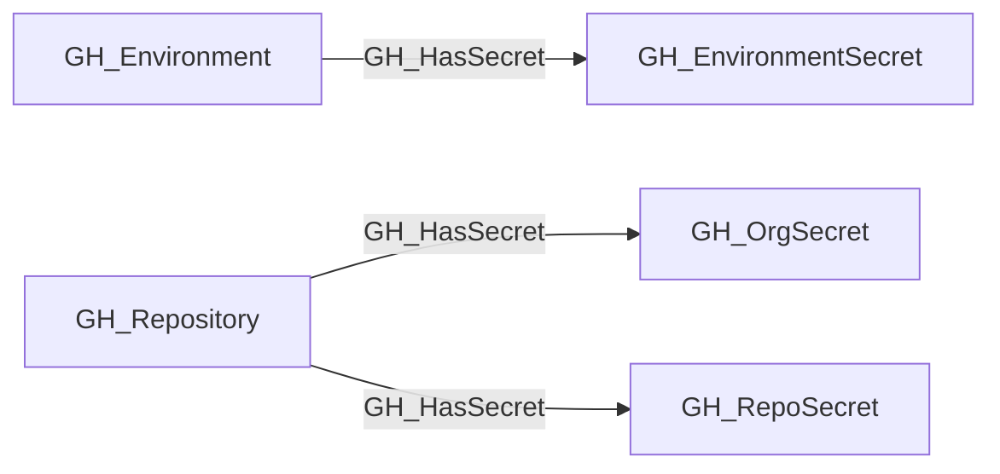

# GH_HasSecret

## General Information

The traversable GH_HasSecret edge represents the relationship between a repository or environment and the secrets accessible within that context. This edge shows which secrets are available in which scopes. Repositories can have access to both organization-level secrets (scoped to selected repositories) and repository-level secrets, while environments expose their own environment-scoped secrets to jobs that target them. This edge is traversable because any principal that can execute a workflow in the relevant context may be able to exfiltrate secret values at runtime, making this a meaningful link in attack path analysis.

## Edge Schema

| Source | Destination | Traversable |
| --- | --- | --- |
| `GH_Environment` | `GH_EnvironmentSecret` | `true` |
| `GH_Repository` | `GH_OrgSecret` | `true` |
| `GH_Repository` | `GH_RepoSecret` | `true` |

## Diagram

