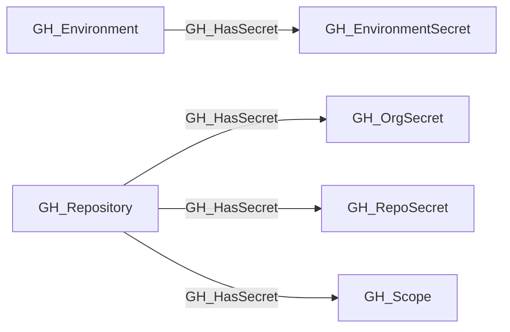

# GH_HasSecret

## General Information

The traversable GH_HasSecret edge represents the relationship between a repository or environment and the secrets accessible within that context. Canonical all/private organization-secret availability is factored through a GH_Scope; selected organization secrets and repository/environment secrets remain direct. This edge is traversable because any principal that can execute a workflow in the relevant context may be able to exfiltrate secret values at runtime, making this a meaningful link in attack path analysis.

## Edge Schema

| Source | Destination | Traversable |
| --- | --- | --- |
| `GH_Environment` | `GH_EnvironmentSecret` | `true` |
| `GH_Repository` | `GH_OrgSecret` | `true` |
| `GH_Repository` | `GH_RepoSecret` | `true` |
| `GH_Repository` | `GH_Scope` | `true` |

## Diagram

```mermaid
graph LR
    n0["GH_Environment"]
    n1["GH_EnvironmentSecret"]
    n2["GH_Repository"]
    n3["GH_OrgSecret"]
    n4["GH_RepoSecret"]
    n5["GH_Scope"]
    n0 -->|GH_HasSecret| n1
    n2 -->|GH_HasSecret| n3
    n2 -->|GH_HasSecret| n4
    n2 -->|GH_HasSecret| n5
```
