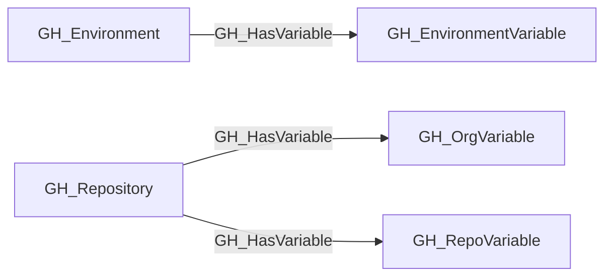

# GH_HasVariable

## General Information

The traversable GH_HasVariable edge represents the relationship between a repository or environment and the variables accessible within that context. This edge shows which variables are available in which scopes. Repositories can have access to both organization-level variables (scoped by visibility to all, private, or selected repositories) and repository-level variables defined directly on the repo, while environments expose their own environment-scoped variables to jobs that target them. This edge is traversable because any principal that can execute a workflow in the relevant context may be able to read variable values at runtime, and variables may contain configuration data useful for lateral movement such as deployment URLs, service names, or environment identifiers.

## Edge Schema

| Source | Destination | Traversable |
| --- | --- | --- |
| `GH_Environment` | `GH_EnvironmentVariable` | `true` |
| `GH_Repository` | `GH_OrgVariable` | `true` |
| `GH_Repository` | `GH_RepoVariable` | `true` |

## Diagram

