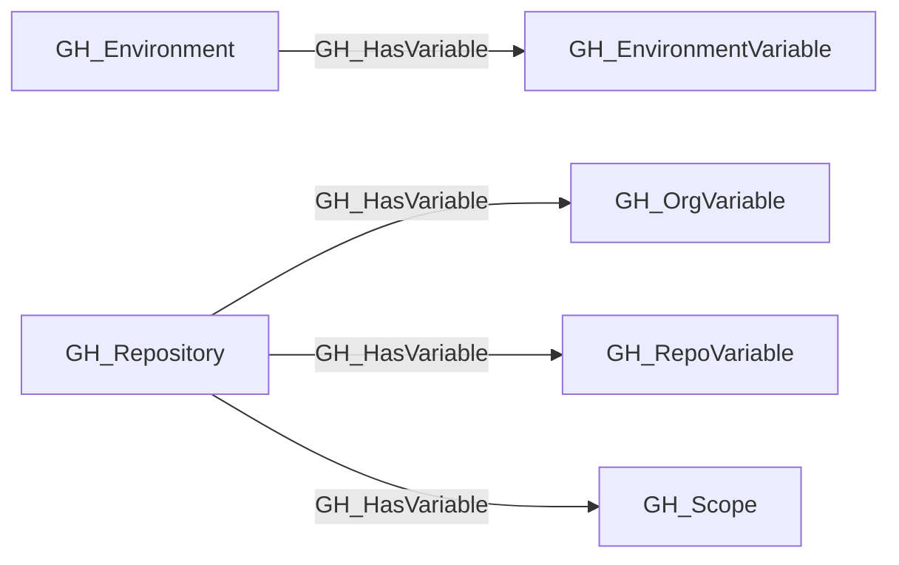

# GH_HasVariable

## General Information

The traversable GH_HasVariable edge represents the relationship between a repository or environment and the variables accessible within that context. Canonical all/private organization-variable availability is factored through a GH_Scope; selected organization variables and repository/environment variables remain direct.

## Edge Schema

| Source | Destination | Traversable |
| --- | --- | --- |
| `GH_Environment` | `GH_EnvironmentVariable` | `true` |
| `GH_Repository` | `GH_OrgVariable` | `true` |
| `GH_Repository` | `GH_RepoVariable` | `true` |
| `GH_Repository` | `GH_Scope` | `true` |

## Diagram

```mermaid
graph LR
    n0["GH_Environment"]
    n1["GH_EnvironmentVariable"]
    n2["GH_Repository"]
    n3["GH_OrgVariable"]
    n4["GH_RepoVariable"]
    n5["GH_Scope"]
    n0 -->|GH_HasVariable| n1
    n2 -->|GH_HasVariable| n3
    n2 -->|GH_HasVariable| n4
    n2 -->|GH_HasVariable| n5
```
