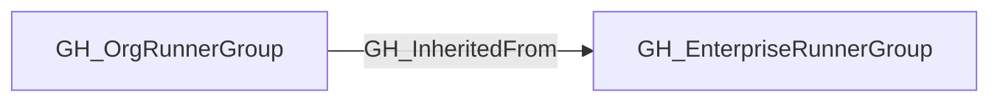

# GH_InheritedFrom

## General Information

The traversable GH_InheritedFrom edge links an inherited GH_OrgRunnerGroup to the GH_EnterpriseRunnerGroup that owns the underlying runner set. This preserves the organization-local view of a runner group while still identifying the enterprise source that provides the runners.

This edge is traversable because an inherited organization runner group is the organization-facing policy boundary for the enterprise runner group. Repository access flows through the organization runner group, then through GH_InheritedFrom to the enterprise group, and finally through GH_HasRunner to directly assigned enterprise runners.

## Edge Schema

| Source | Destination | Traversable |
| --- | --- | --- |
| `GH_OrgRunnerGroup` | `GH_EnterpriseRunnerGroup` | `true` |

## Diagram

