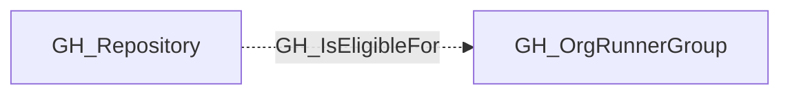

# GH_IsEligibleFor

## General Information

The non-traversable GH_IsEligibleFor edge represents that a repository is within the repository-access scope of an organization runner group.

For runner groups, this edge evaluates the group's `visibility`, selected repository assignments, and `allows_public_repositories` setting. It does not prove that workflows in the repository can dispatch to the group's runners, because GitHub Actions may be disabled for the repository or the runner group may be restricted to selected workflows.

## Edge Schema

| Source | Destination | Traversable |
| --- | --- | --- |
| `GH_Repository` | `GH_OrgRunnerGroup` | `false` |

## Diagram

