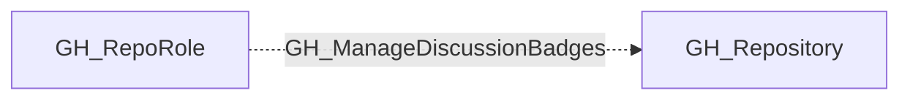

# GH_ManageDiscussionBadges

## General Information

The non-traversable GH_ManageDiscussionBadges edge represents a role's ability to manage discussion badges used to highlight discussion participants. This permission is available to Write, Maintain, and Admin roles and custom roles that have been granted this specific permission.

## Diagram

```mermaid
graph LR
    n0["GH_RepoRole"]
    n1["GH_Repository"]
    n0 -.->|GH_ManageDiscussionBadges| n1
```

## References

- [Repository roles](https://docs.github.com/en/organizations/managing-access-to-your-organizations-repositories/repository-roles-for-an-organization)
