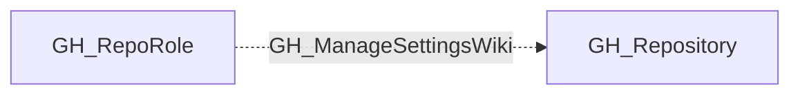

# GH_ManageSettingsWiki

## General Information

The non-traversable GH_ManageSettingsWiki edge represents a role's ability to enable or disable the repository wiki. This permission is available to Maintain and Admin roles and custom roles that have been granted this specific permission.

## Edge Schema

| Source | Destination | Traversable |
| --- | --- | --- |
| `GH_RepoRole` | `GH_Repository` | `false` |

## Diagram

