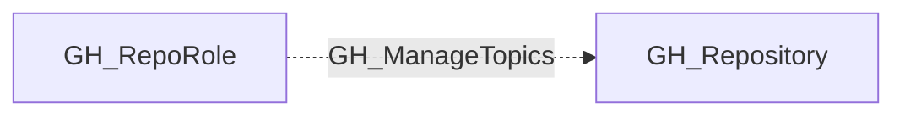

# GH_ManageTopics

## General Information

The non-traversable GH_ManageTopics edge represents a role's ability to manage repository topics used for discovery and classification. This permission is available to Maintain and Admin roles and custom roles that have been granted this specific permission.

## Edge Schema

| Source | Destination | Traversable |
| --- | --- | --- |
| `GH_RepoRole` | `GH_Repository` | `false` |

## Diagram

