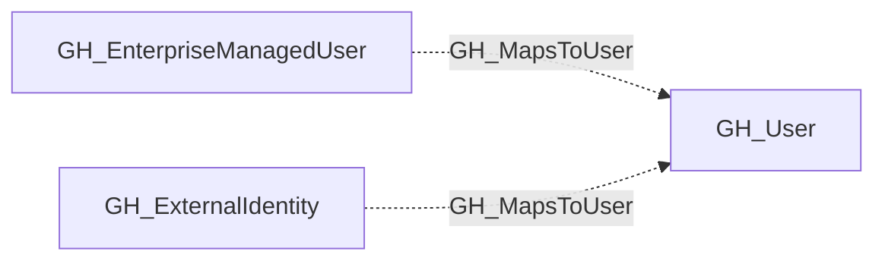

# GH_MapsToUser

## General Information

The non-traversable GH_MapsToUser edge maps an external identity (provisioned via SAML or SCIM) to a GitHub user within the organization, or to an external IdP user (such as [AZUser](https://bloodhound.specterops.io/resources/nodes/az-user), [Okta_User](https://bloodhound.specterops.io/opengraph/extensions/okta/nodes/okta_user), or [PingOneUser](https://github.com/andyrobbins/PingOneHound?tab=readme-ov-file#schema)) in hybrid graph scenarios. This edge represents identity correlation rather than an attack path, connecting a user's external IdP account to their GitHub account for visibility into federated identity mappings.

## Edge Schema

| Source | Destination | Traversable |
| --- | --- | --- |
| `GH_EnterpriseManagedUser` | `GH_User` | `false` |
| `GH_ExternalIdentity` | `GH_User` | `false` |

## Diagram

