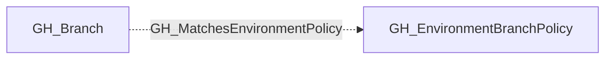

# GH_MatchesEnvironmentPolicy

## General Information

The non-traversable GH_MatchesEnvironmentPolicy edge links a branch to a GitHub Environment deployment branch policy that it satisfies.

This edge is emitted when a branch name matches the pattern defined by a GH_EnvironmentBranchPolicy node, such as `main`, `release/*`, or `release/**/*`. The edge is structural rather than directly traversable because matching a policy alone does not guarantee deployment access; the environment may still require protected branches, reviewers, wait timers, or other controls.

GH_MatchesEnvironmentPolicy is primarily used as supporting evidence for computed GH_CanDeployToEnvironment edges.

## Edge Schema

| Source | Destination | Traversable |
| --- | --- | --- |
| `GH_Branch` | `GH_EnvironmentBranchPolicy` | `false` |

## Diagram

