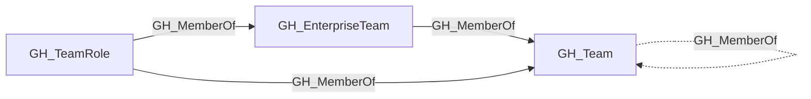

# GH_MemberOf

## General Information

The traversable GH_MemberOf edge represents team membership and projection relationships, linking a team role to its parent team, a child team to a parent team in nested team hierarchies, or a GH_EnterpriseTeam to its projected GH_Team in an organization. This edge is traversable because these relationships carry effective team membership context through the graph: a user who holds a role in a child team inherits the repository permissions of ancestor teams, and enterprise-managed team membership flows into the projected organization team.

## Edge Schema

| Source | Destination | Traversable |
| --- | --- | --- |
| `GH_EnterpriseTeam` | `GH_Team` | `true` |
| `GH_Team` | `GH_Team` | `false` |
| `GH_TeamRole` | `GH_EnterpriseTeam` | `true` |
| `GH_TeamRole` | `GH_Team` | `true` |

## Diagram

