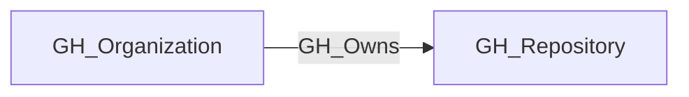

# GH_Owns

## General Information

The traversable GH_Owns edge represents that an organization owns a repository. This edge establishes the foundation of the access control model by linking repositories to their owning organization. It is traversable because repository ownership is a critical relationship for understanding how organizational permissions cascade down to repository-level access, making it essential for attack path analysis.

## Edge Schema

| Source | Destination | Traversable |
| --- | --- | --- |
| `GH_Organization` | `GH_Repository` | `true` |

## Diagram

