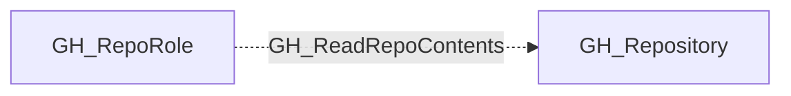

# GH_ReadRepoContents

## General Information

The non-traversable GH_ReadRepoContents edge represents a role's ability to read repository contents including source code, issues, and pull requests. This is the base level of repository access, available to all roles at the Read permission level and above (Read, Triage, Write, Maintain, Admin).

## Edge Schema

| Source | Destination | Traversable |
| --- | --- | --- |
| `GH_RepoRole` | `GH_Repository` | `false` |

## Diagram

