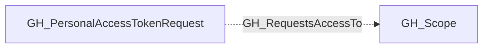

# GH_RequestsAccessTo

## General Information

The non-traversable GH_RequestsAccessTo edge records access sought by a pending fine-grained personal access token request. It is distinct from GH_CanAccess, which represents access GitHub has already granted. An all-repository request targets the organization's reusable repository/all GH_Scope.

## Edge Schema

| Source | Destination | Traversable |
| --- | --- | --- |
| `GH_PersonalAccessTokenRequest` | `GH_Scope` | `false` |

## Diagram

