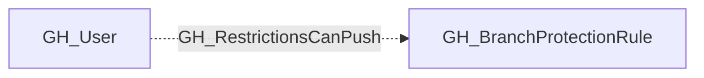

# GH_RestrictionsCanPush

## General Information

The non-traversable GH_RestrictionsCanPush edge represents a per-actor allowance that grants push access through push restrictions on a branch protection rule. This edge identifies specific users or teams that are permitted to push to the protected branch even when push restrictions are active. This is security-relevant because push restrictions limit who can directly push to a branch, and actors with this allowance bypass that control. Unlike GH_BypassPullRequestAllowances, this allowance is NOT suppressed by `enforce_admins` — listed actors retain push access regardless of admin enforcement settings.

## Edge Schema

| Source | Destination | Traversable |
| --- | --- | --- |
| `GH_User` | `GH_BranchProtectionRule` | `false` |

## Diagram

