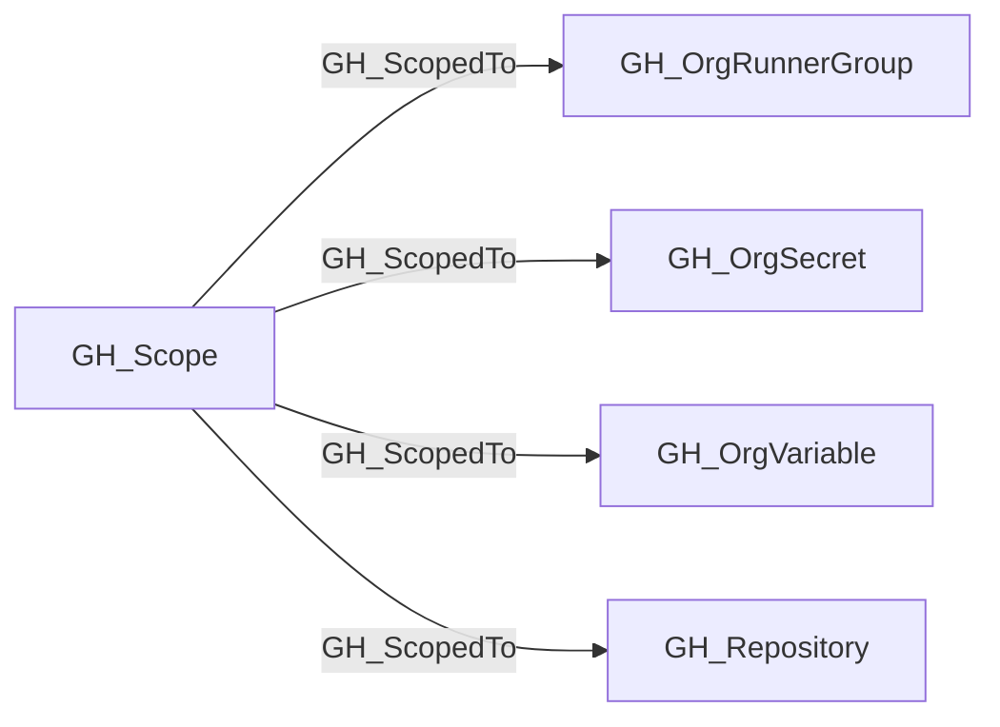

# GH_ScopedTo

## General Information

The traversable GH_ScopedTo edge enumerates an asset included in a reusable GH_Scope. It carries an incoming capability from a target scope to each asset in the represented set. Repository scopes contain collected repositories, runner-group scopes contain organization-facing runner groups sharing repository eligibility, and organization-secret/variable scopes contain assets sharing repository availability.

## Edge Schema

| Source | Destination | Traversable |
| --- | --- | --- |
| `GH_Scope` | `GH_OrgRunnerGroup` | `true` |
| `GH_Scope` | `GH_OrgSecret` | `true` |
| `GH_Scope` | `GH_OrgVariable` | `true` |
| `GH_Scope` | `GH_Repository` | `true` |

## Diagram

