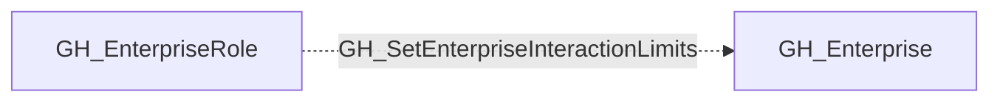

# GH_SetEnterpriseInteractionLimits

## General Information

[Enterprise] Enterprise role can set interaction limits.

## Edge Schema

| Source | Destination | Traversable |
| --- | --- | --- |
| `GH_EnterpriseRole` | `GH_Enterprise` | `false` |

## Diagram

