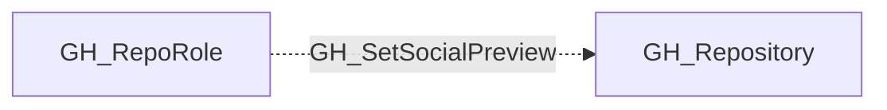

# GH_SetSocialPreview

## General Information

The non-traversable GH_SetSocialPreview edge represents a role's ability to set the repository social preview image shown in link previews. This permission is available to Maintain and Admin roles and custom roles that have been granted this specific permission.

## Edge Schema

| Source | Destination | Traversable |
| --- | --- | --- |
| `GH_RepoRole` | `GH_Repository` | `false` |

## Diagram

